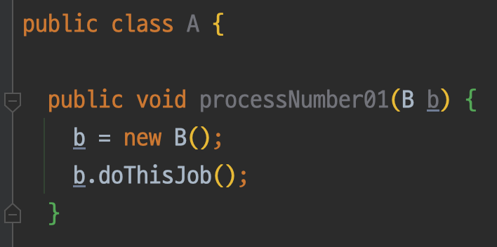
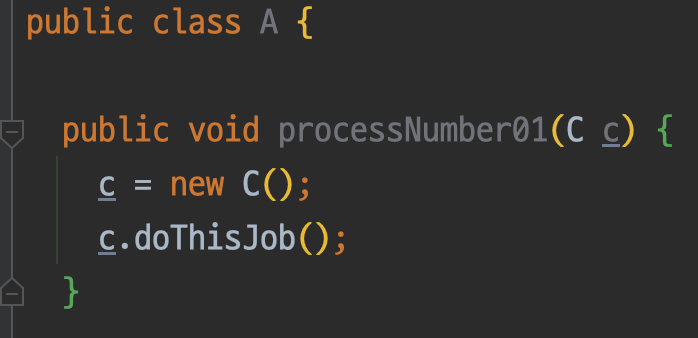
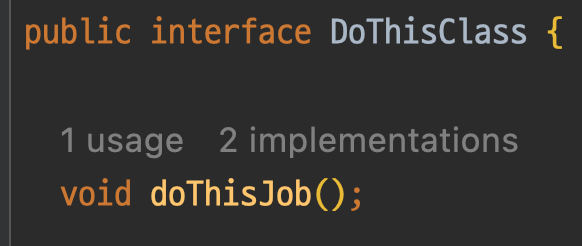
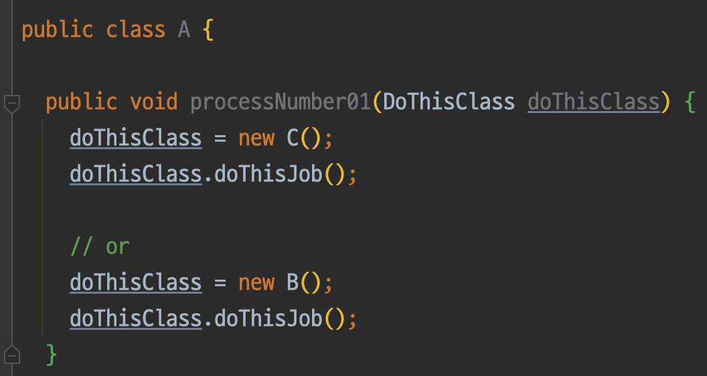

---

🍎 프로젝트 관련
→ xml File에 Entity와 매핑되어 있는 ResultMap을 걷어내고 Repository와 Mybatis Dao 사이에 Model Mapper를 뒀습니다.
→ Model Mapper를 도입하게 된 이유는 Entity와 의존성이 있는 xml 파일에서 두 사이에 Model Mapper를 끼워넣어 xml file의 가독성을 높이고 프로덕트 코드 레벨에선 비지니스에 더 집중할 수 있기 때문입니다.
→ HttpClient를 사용해 다른 패키지에 요청을 보내 Package 간 통신을 만들었습니다.

→ 아래 사진을 보면 그 차이를 더 확실하게 알 수 있습니다.

<Entity와 Mybatis xml File이 강하게 맺힌 경우>

<직접 쿼리가 작성되는 부분>

<Model Mapper 변경 후 결과>

→ 위 과정을 거친 결과 더욱 깔끔해진 코드를 얻을 수 있었습니다.

🍎 새로 알게된 사실 혹은 알고 있던 사실에대한 질문, 답변

🍏 DAO, MapperModel, MapperDto
→ Mybatis에서 DAO는 @Mapping Annotaion을 갖고 있는 객체가 담당합니다. 해당 객체는 Repository와 DB사이에 존재하며 계층 사이 분리를 도와줍니다.

→ MapperModel은 Entity와 Mapper 사이에 존재하며 Entity가 갖고 있는 Property를 Flat하게 만들어줍니다. 이는 DB에 Data를 적재할 때 중요하게 작용합니다. DB에 적재될 땐 DB는 사용자가 정의한 데이터를 알지 못하고 Manage할 수 있는 데이터만을 처리할 수 있습니다.

→ MapperDto는 DB에서 읽은 Query를 바탕으로 가져오는 데이터들을 담는 역할을 수행합니다. DB 자신이 다룰 수 있는 데이터만을 사용할 수 있음으로 MapperDto 필드 타입은 기본 타입의 경우가 많습니다.

🍏 Java 인터페이스 사용에 관한 생각
❓ 질문을 받았습니다. DB에서 발생하는 Exception도 DIP를 통해 예외를 던지는 것을 아시나요?
→ 여태 DB에서 던지는 예외를 IDE에서 자동으로 띄워줘서 이런 생각을 해본 적이 없었습니다. 이를 알아보기 위해 DIP를 이루기위해 어떤 방식을 사용하는지 정의가 필요했습니다.
→ DIP를 이루기 위해 Interface라는 규약을 정의할 수 있는 부분을 만들었습니다.

  ❓ 그렇다면 Interface가 없다면 어떤 일이 발생할까요?
  → Interface가 없을 때를 생각해봅시다. 이미지에서 알 수 있듯이 고수준의 A 클래스에서 저수준의 B, C 클래스에의해 A에 변경의 여파가 큽니다.
  
  

  Tip) 고수준의 객체와 저수준의 객체는 어떠한 기준으로 나누나요?
  * 고수준의 객체와 저수준의 객체는 상대적입니다.
  * 이 두 기준을 나누는 조건은 첫째, 입출력과의 거리가 얼마나 떨어져 있냐는 것이고 둘째는 핵심 정책을 얼마나 더 많이 소유하는가입니다.
  → Interface를 사용하지 않는다면 변경의 여파가 최소화되어야 하는 **고수준**에서 정책이 바뀔 때마다 많은 변경 사항이 발생합니다.

  ❓ Interface를 사용하면 어떻게 되나요?
  
  → 위와 같이 적용하게 된다면 고수준의 객체가 저수준의 객체를 사용한다 한들 영향을 받지 않습니다.
  

  → 다시 돌아와서 DB와 그 DB를 사용하고 있는 프로젝트에서 관계를 살펴보면 DB에서 예외가 발생할 때(Ex, DB Syntax Exception), DB에서 던진 예외를 받아와 예외를 터트려줍니다.

🍏 Path Variable과 Query Parameter는 언제 사용해야 할까?
→ 만약 어떤 resource를 식별하고 싶으면 Path Variable을 사용하고,정렬이나 필터링을 한다면 Query Parameter를 사용하는 것이 Best Practice이다.

📖 Effective Java
* 예외는 진짜 예외 상황에만 사용하라
* 복구할 수 있는 상황에는 검사 예외를, 프로그래밍 오류에는 런타임 예외를 사용하라
* 필요 없는 검사 예외 사용은 피하라
* 표준 예외를 사용하라
* 추상화 수준에 맞는 예외를 던지라
* 메서드가 던지는 모든 예외를 문서화하라
* 예외의 상세 메세지에 실패 관련 정보를 담으라
* 가능한 한 실패 원자적으로 만들라
* 예외를 무시하지 말라
