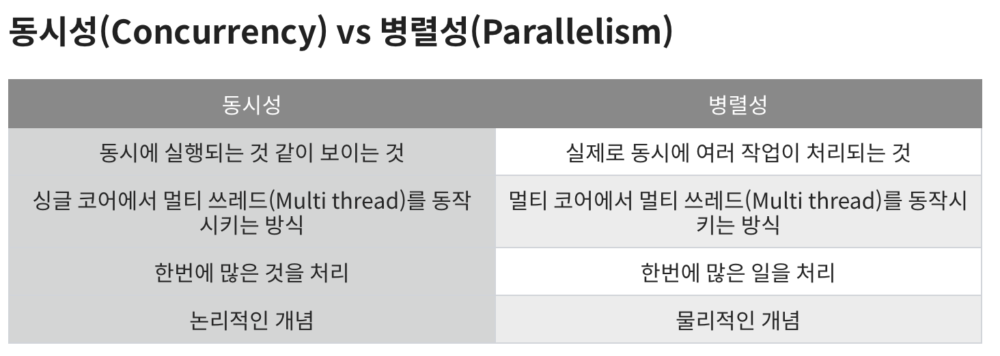

---

🍎 프로젝트 관련
→ 웹 클라이언트를 사용해 다른 패키지에 Request를 보내던 중 문제가 발생했습니다. 확인해보니 WebClient를 Create or Builder를 사용해 어떤 메세지를 던질지 선언부와 실제로 요청을 전송하는 Trigger 부분이 따로 존재한다는 것을 알았습니다.
→ Library도 결국 클래스로 이루어져있고 해당 클래스의 Signature를 사용하려면 호출이 필요하다는 당연한 사실을 놓치고 있었습니다. 해당 부분 수정했고 현재 마지막 데이터 조회 쿼리를 손보고 있습니다.

🍎 새로 알게된 사실 혹은 알고 있던 사실에대한 질문, 답변

🍏 동시성 in Java
→ 동시성과 병렬성의 의미가 정확하지 않아 정리했다.

❓자바에서 이야기하는 동시성과 병렬성은 어떤 차이가 존재할까?

→ 동시성은 여러 작업이나 활동을 동시에 처리할 수 있는 시스템의 능력을 말하며, 병렬로 작동하는 것처럼 보입니다. 그것은 공유 자원에 대한 접근을 관리하고 올바르게 실행되도록 작업의 실행을 조정하는 것과 관련이 있습니다.

→ 반면에 병렬 처리는 별도의 프로세서나 코어에서 동시에 여러 작업을 실제로 실행하는 것을 의미합니다. **병렬성은 동시성을 구현하는 수단**이지만, 모든 동시 시스템이 병렬인 것은 아니다.

→ 자바에서 동시성은 다중 스레드를 사용하여 달성되며, 여기서 여러 실행 스레드가 단일 프로세스 내에서 동시에 실행됩니다. 병렬성은 별도의 코어에서 이러한 스레드를 실행함으로써 달성될 수 있다.

❓불변 객체는 어떤 이점을 가져다 주는걸까요?

→ 불변 객체는 멀티 스레드 환경에서 다른 스레드가 불변 객체를 변경하더라도 내부 값은 변경되지 않기 때문에, 다른 스레드에 영향을 받지 않아 동시성 문제를 해결할 수 있습니다.

🍏 Docker

❓ Docker란 무엇일까요?
→ Docker란 응용 프로그램들을 프로세스 격리 기술을 사용하여 Container로 실행하고 관리하는 오픈 소스 프로젝트 입니다.

❓ Container란 무엇인가요?
→ 넓은 범위의 Container란 무언가의 생성, 운영, 제어까지 Life Cycle을 관리하는 곳입니다.
→ Docker Container는 Docker image의 목적에 따라 생성되는 프로세스 단위 격리 환경을 이야기 합니다.

❓ Docker Image란 무엇인가요?
→ Service에 필요한 프로그램, 소스 코드, 라이브러리, 실행 파일을 가지고 있는 형태를 docker image라고 합니다. 즉 특정 프로세스를 실행하기 위한 ( Docker Container를 실행하기 위한 ) 모든 설정을 가지고 있는 파일을 이야기 합니다.

❓ 프로세스 단위 격리는 무엇인가요?
→ Docker Container는 “프로세스 단위 격리 환경” 이라고 하였습니다.
→ 각각의 서버마다 환경은 다를 수 있습니다. windows, linux 등등 여러 환경이 존재합니다. 각 서버는 HostOS를 가지고 있는데, Docker Container는 Host Os와 격리되어 같은 운영체제가 아니더라도 Container 마다 서로 다른 OS를 가지는 등 독립적인 환경을 구축할 수 있습니다. 또한, Container들은 서로 독립된 상태이므로 같은 프로그램의 다른 버전을 구축하여도 문제가 생기지 않습니다.

ex )
A Container : windows 환경, java 11, postgre …
B Container : linux 환경, java 17, oracle …

→ 서로 다른 OS를 가질 수 있고 같은 프로그램의 다른 버전을 사용해도 Container는 분리되어 있기 때문에 문제가 생기지 않음!

❓ 서로 격리가 되어있다는 사실을 알게 되었지만 “프로세스”는 왜 붙은걸까요 ?
→ 먼저 “가상화”라는 단어에 대해서 알아봅시다!
→ 가상화란 각기 다른 서비스 수행하기 위해 나타난 개념입니다. 서버의 자원을 가지고 각각 다른 서비스들이 자원을 할당 받아 수행할 수 있도록 하는 것입니다.

🍏 서버 가상화
→ 하나의 서버 Host에서 여러 개의 서버 운영체제를 GuestOS 실행할 수 있게 하는 S/W Architecture 입니다. HyperVisor를 이용하여 서로 다른 OS를 가진 가상 머신(Virtual Machine)을 생성하는 방식입니다.
→ VM을 통한 서버 가상화는 결국 HostOs에서 각각 자원을 일정 부분 할당 받고 사용하기 때문에 유연하지 못하고 결국 OS 구동에 필요한 환경을 구축하는 것이기 때문에 무겁습니다.

🍏 컨테이너 기반 가상화
→ 하나의 Engine으로 Container들을 구동할 수 있습니다. 또한 각각의 컨테이너는 독립되어 있지만 HostOs에서 자원을 끌어다 쓰는 Process 형태로 실행이 됩니다. 하나의 Engine에서 모든 환경들을 실행할 수 있어서 매우 가볍습니다.

📖 Effective Java
* 공유 중인 가변 데이터는 동기화해 사용하라
* 과도한 동기화는 피하라
* 스레드보다는 실행자, 태스크, 스트림을 애용하라
