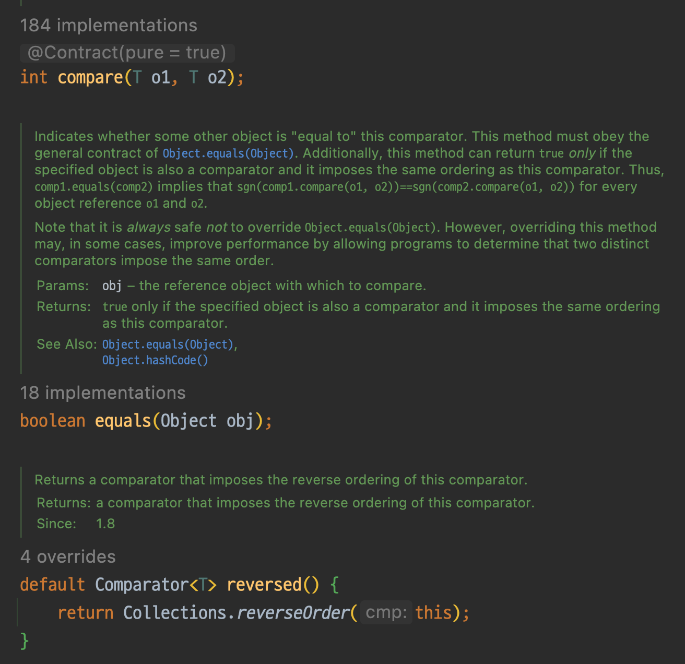

---

🍎 프로젝트 관련

🍎 새로 알게된 사실 혹은 알고 있던 사실에대한 질문, 답변

❓ Quick Sort, Merge Sort 어떤 알고리즘을 사용해야 할까요?

→ Quick Sort가 Merge Sort보다 대게 성능이 좋은 이유는 Locality와 관련이 있습니다.
→ Quick Sort는 pivot를 사용해 정렬을 수행합니다.
→ Merge Sort는 각각으로 다 쪼개어 작은 그룹을 정렬한 후 더 큰 그룹으로 합쳐나가는 Botton-Up 방식을 사용합니다.

→ Quick Sort는 Merge Sort보다 참조 지역성에서 유리합니다.
→ 정렬하려고 하는 데이터들이 다른 페이지로 이동하는 것 없이, 자신의 페이지에서 계속 있다면 이는 cache hit를 의미합니다. 그렇지 않다면 physical memory로 접근을 해야 하기 때문에 시간이 상대적으로 오래 걸립니다.
→ 만약 자신의 페이지에 계속 있는다면, cache에서 반복적으로 접근하기 때문에 시간이 덜 걸립니다.
→ 결국 데이터가 이동하지 않을수록 좋습니다.

→ 정리해보면, Quick Sort는 Merge Sort에 비해 pivot에 의한 분할은 했지만 데이터가 존재하는 위치는 변하지 않습니다. 따라서 제자리 정렬이라 할 수 있으며 지역성의 원리에 따라 더 빠른 성능을 보이기도 한다는 것입니다.

❓ Java Comparator 제공하는 함수가 compare, equals, reversed를 제공하는데 람다(함수형 인터페이스)를 사용할 수 있는 이유는 무엇인가요?

→ Comparator는 @FunctionalInterface를 사용하며 java.util library 안에 존재합니다.
→ FunctionalInterface를 사용하게 되면 하나의 함수만 정의하고 이를 Lambda 식으로 표현해 사용할 수 있습니다.

→ 위 내용을 알기위해선 default keyword를 알아야합니다.

❓ equals의 경우 default가 붙어있지 않은데 어떻게 된 일인가요?
→ 구현체에서 선언해 사용하라고 명시한 이유입니다.

→ reversed의 경우 정의가 되어있는 것을 볼 수 있습니다. 이를 통해 상속받은 곳에서 재정의 하는 것을 막습니다.

→ 위의 이유때문에 Comparator는 FunctionalInterface로 compare를 Lambda 식에 사용할 수 있습니다.

❓ default access keyword?
→ interface 작성 시, default로 선엄함으로 메소드를 구현할 수 있습니다.
→ 상속받아 사용할 때 잘못된 사용을 막고자 하기 위함이다.
