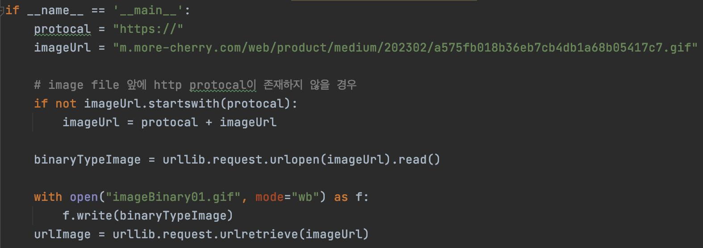
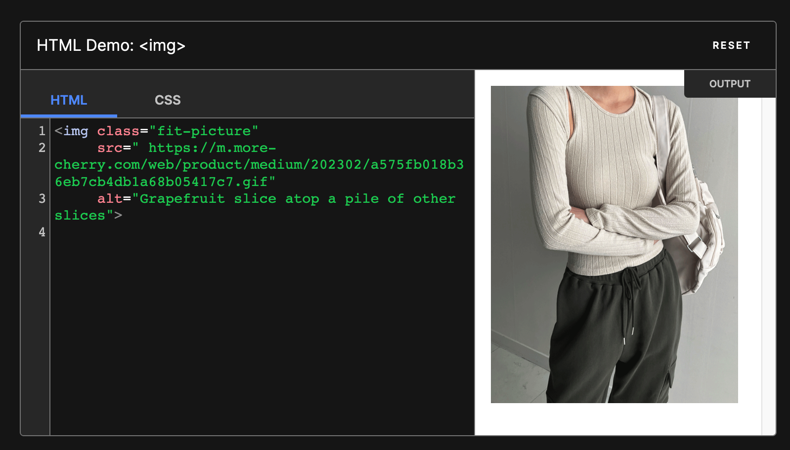

---

🍎 새로 알게된 사실 혹은 알고 있던 사실에대한 질문, 답변

🍏 Test 실행 시, SeedData가 존재할 경우(in data.sql) Test 격리를 위해 Before Each 마다 DB를 Clear시 제거해야 할 대상이 명확하지 않아 Exception이 발생합니다.

❓ Crawling 에서 WEB Image Data 저장을 어떤 방식으로 해야할까요?

→ Web Image를 저장해야하는 요구사항을 만족시키기 위해 web에서 제공하는 https://~.png 를 가져와 binary 데이터로 변경해 저장하는 방법을 생각했습니다.

→ 위와 같이 로직을 작성한다면 DB에 많은 공간이 필요하다는 문제가 발생하고 조회 시 좋지 않은 성능을 보일 것입니다.

→ 이 때 사용할 수 있는 다른 방안으로 http img tag에 해당 url 주소를 넣는 방식으로 진행한다면 BLOB type이 아닌 VARCHAR로 데이터의 무게가 가벼워집니다.

