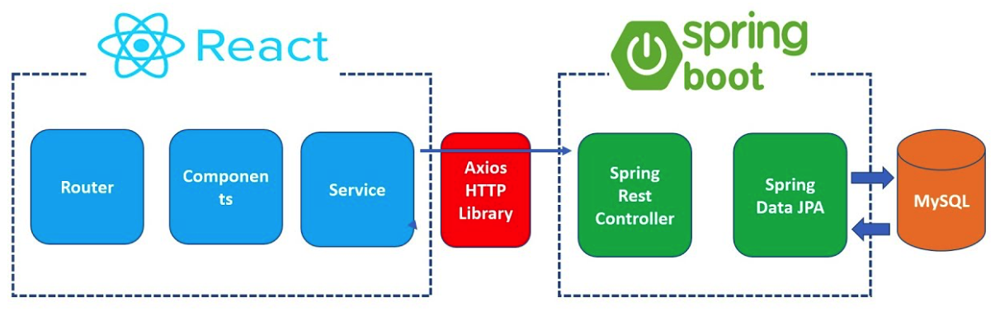

---

🍎 새로 알게된 사실 혹은 알고 있던 사실에대한 질문, 답변

🍏 Selenium webDriver를 통해 Dynamic Page를 제어할 때, Dom에서 SPA로 작성할 시 find_element를 다시 설정해주지 않아도 됩니다. 하지만, Page가 변경되는 부분이라면 이야기가 다릅니다. 새로운 페이지가 전체 렌더링 되는 것이기 때문에 find_element로 동적 입력을 불러일으킬 곳을 이야기해줘야합니다.

🍏 pymysql library에선 int type도 %s 형식 지정자로 넘깁니다. 또한 Insert 시 schema에 일치하는 이름을 적어줘야합니다.

🍏 React JSX란 무엇인가요?

→ JSX는 JavaScript를 확장한 문법입니다. UI가 어떻게 생겨야 하는지 설명하기 위해 React와 함께 사용할 것을 권장합니다. JSX는 JS의 모든 기능이 포함되어 있습니다.

→ JSX는 React "Element"를 생성합니다.

🍏 React - Spring 구조

1. Web Browser에서 React 애플리케이션의 URL로 접속
2. Web Browser에서 요청한 URL에 따라 React-Router에서 해당 URL에 해당하는 페이지의 내용을 Rendering하는 최상위 Component를 불러옵니다.
3. Component가 Rendering될 때 Service에 미리 정의해둔 함수를 사용해서 데이터를 가져옵니다.
4. Service에서는 axios 패키지의 기능을 사용해서 Spring boot Api와 http 통신을 주고 받습니다.
5. React쪽의 Serivce에서 요청한 Http Request를 Rest Controller에서 수신합니다.
6. Rest Controller에서 Service를 호출하여 React쪽의 Service에서 요청한 것에 해당하는 기능을 수행합니다.
7. Service에서는 Repository를 호출하여 데이터 CRUD 작업을 처리합니다.
8. Repository에서 DB를 호출하여 데이터 CRUD 작업을 처리합니다.

🍏 Props를 통해 객체의 형태로 데이터를 이동시킬 수 있습니다. props를 통해 객체의 형태로 데이터를 이동시키고 싶지 않다면 각각의 인자들을 채워 넣은 채로 사용할 수 있습니다.

❓ Url Resource는 어떤 방식으로 사용해야 할까요?

→ 현재 만들고 있는 JBLY Project에선 shop entity가 존재하지 않습니다. shop은 product를 List로 갖고 있고 데이터의 CUD 작업이 발생한다면 shop을 통해 작업해야하는 AggregateRoot입니다. 

→ 기존에 생각하기론 shopName를 PathVar로 받아올 계획이었으나 아직 해당 Resource는 만들지 않고 shopName까지 Query에 영향을 끼치는 것이니 query param에 page, size와 같이 넘기는 것이 더 효율적이라고 생각합니다. shop entity를 개발한다면 리팩토링이 필요한 부분입니다.

→ 기존 : /api/v1/product/{shopName}?page=1&&size=10

→ 변경 : /api/v1/product?page=1&&size=10&&shopName=shop

