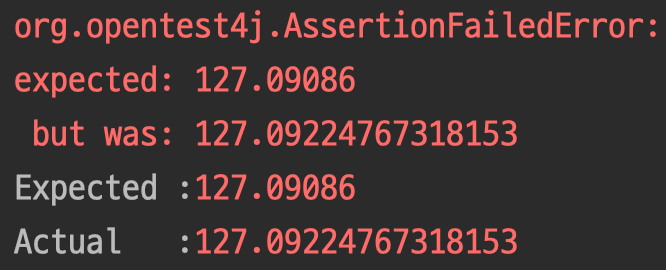

---

🍎 현재 위치를 기반으로 내 주변 가까운 수영장 위치를 찾아 보여주는 애플리케이션 개발을 진행합니다.

🍎 프로젝트는 Spring boot를 통해 생성했습니다.

❓ 왜 boot를 통해 프로젝트를 생성했나요?

- 스프링 부트가 초기 애플리케이션의 설정을 간편하게 처리해주기 때문에 사용했습니다.
- 간단한 초기 설정 이외에도 자체적인 웹 서버를 내장하고 있어 빠르고 간편하게 배포를 진행할 수 있습니다. 또한, boot를 사용하면 독립적으로 실행 가능한 Jar 파일로 프로젝트를 빌드할 수 있어, 향후 클라우드 서비스 및 도커와 같은 가상화 환경에 빠르게 배포할 수 있습니다.

🍎 부트를 통해 빠르게 프로젝트 초기 설정을 마칠 수 있었습니다. 서비스를 제공하기 위해 데이터를 어디서 어떤 방식으로 가져와야 하는 지 고민이 됐습니다.

🍎 사용자에게 제공할 위치는 지도에서 찾을 수 있는 정보입니다. 벤더에서 제공하는 위치(지도) API를 사용해 정보를 얻고자 했습니다.

🍎 위치 API를 제공하는 회사는 네이버, 카카오, 구글에서 찾아봤습니다. 세 회사 모두 WSG84 좌표계를 지도에서 사용하고 있었습니다.

⚠️ 문제가 발생했습니다. API에서 제공하는 것은 “특정”위치에 대한 주소를 입력하면 좌표값을 주지만 “특정” 위치. 다시 말해, 수영장의 위치는 구할 방법이 없었습니다.

🍏 공공데이터 포탈을 통해 서울 시에서 운영하고 있는 수영장의 데이터를 구할 수 있었고 수영장의 좌표 값도 함께 JSON type으로 정리가 되어 있었습니다.

⚠️ 하지만 공공데이터에서 제공되는 좌표는 ESPG:2097 입니다. 옳바른 사용을 위해 ESPG:2097 Type에서 좌표 값을 WSG84 Type으로 변경이 필요했습니다.

❓어떻게 좌표를 변경할 수 있을까요?

- Java Library Open Source인 Proj4j를 통해 변경할 수 있습니다.
- 하지만 좌표는 소숫점까지 계산되기 때문에 데이터 정합성을 맞추기 어려웠습니다.

---

📚 Reference

[Spring Boot Reference Documentation](https://docs.spring.io/spring-boot/docs/current/reference/htmlsingle/)

[공공데이터 포털](https://www.data.go.kr/)

[https://github.com/locationtech/proj4j](https://github.com/locationtech/proj4j)
