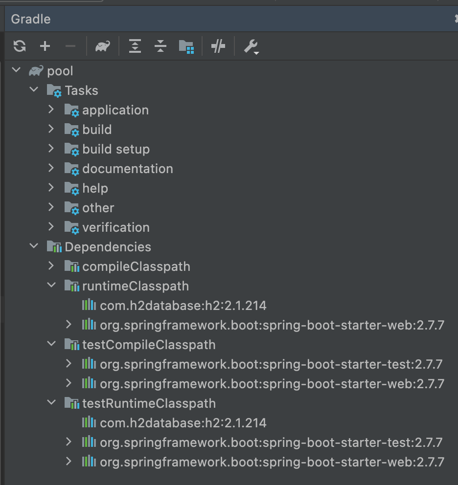
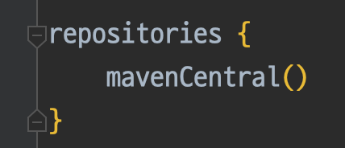

---

🍎 공공데이터에서 얻은 데이터를 어떤 방식으로 핸들링 해야할지 고민을 했습니다.

🍎 데이터 처리를 고민하던 중 공공데이터에서 OpenAPI 형식으로 API 서버를 통해 데이터를 받을 수 있는 방법을 발견했습니다.

❓ 궁금증이 생겼습니다. 현재 로컬에서 개발하는데 어떻게 OpenApi에 데이터를 가져 올 수 있는건지?

❓ 나는 인터넷에 내 프로젝트를 연결할 적이 없는데 어떤 방식으로 인터넷 연결이 되어 데이터를 요청할 수 있는 건지?

→ 너무나도 당연하게 숨쉬듯 인터넷을 사용하고 있어 개발 환경에서 인터넷을 어떤 방식으로 이용하고 있는지 알고 있지 못해 생긴 의문점이었습니다.

→ 이전의 생각으론 WAS 서버를 개발하고 개발한 서버를 “배포”를 해야 인터넷 통신을 할 수 있다는 생각을 하고 있었는데 이런 생각이 틀리다는 것을 알았습니다.

→ 인터넷(와이파이)를 사용하고 있는 동안 외부 통신을 이루는 과정은 다음과 같습니다.

1. 로컬에서 실행하는 서버(Spring) Port 번호 할당(IP를 할당하는 것이 아닌 한 PC에서 다른 포트를 열어줍니다.)
2. 라우터를 통해 인터넷 통신
3. 요청을 받은 서버에서 응답
4. 응답이 로컬에서 실행중인 서버에 도착

→ 위의 과정을 통해 인터넷이 연결된 상황일 때 통신을 할 수 있었습니다.

→ HTTP 통신 시 사용자의 통신을 돕는 Servlet을 사용하고 더 아래에 소켓을 사용한 통신이 존재한다는 것 또한 알게되었습니다.

🍏 나아가 생각해보기

❓ 오직 라이브러리만을 사용해 개발을 진행한다는 생각을 갖고 있을 때, 프로젝트 초기 라이브러리들은 어떤 방식으로 다운을 받게 되는 것일까?

→ 초기 자바 개발 환경 세팅 시 JDK를 다운로드하면 모든 라이브러리들을 다 가져오는 것이라고 생각했습니다.

→ 위 이야기는 틀렸습니다. 하지만 위와 같이 생각하게 된 이유는 아래 이미지에서 비롯된 잘못된 추측이었습니다.

→ 위 사진은 IDE 환경에서 제공하는 의존성을 보여주는 것이지 라이브러리를 처음부터 갖고 있다는 말이 아닙니다.

❓ 그렇다면 라이브러리는 어떤 방식으로 가져오는 것인가요?

→ 정답은 repositories in Gradle script에 있었습니다. 프로그래머가 dependency에 의존성을 추가하고 Gradle Refresh를 수행하게 되면 “인터넷”으로 연결한 mavenCentral 공간에서 라이브러리를 다운로드 하는 방식으로 프로그래머에게 제공되는 것이었습니다.

❓ 인터넷에서 자료를 찾아보던 중 Ip Loopback이라는 것이 있고 이는 다른 이름으로 localhost라고 불리는데 was server 띄우는게 localhost:8080아닌가? 그렇다면 ip를 할당하는 것이 아닌가?

→ loopback은 논리적인 인터페이스 카드를 의미하며 자신이 송신한 패킷을 그대로 수신하는 기능을 갖고 있습니다.

→ that the loopback interface is used to access the computer itself, while a web server is used to access content that is being served by the web server. and web server has specific port that was given by OS.

→ 헷갈리는 것을 방지하기 위해서 loopback interface는 127.0.0.1로 명시해 사용하기도 합니다.

---

📚 Reference

[Maven Central Repository](https://maven.apache.org/repository/)

[루프백 - 위키백과, 우리 모두의 백과사전](https://ko.wikipedia.org/wiki/%EB%A3%A8%ED%94%84%EB%B0%B1)

[내부접속(localhost)와 외부접속의 의미](https://prometheus.tistory.com/entry/%EB%82%B4%EB%B6%80%EC%A0%91%EC%86%8Dlocalhost%EC%99%80-%EC%99%B8%EB%B6%80%EC%A0%91%EC%86%8D%EC%9D%98-%EC%9D%98%EB%AF%B8)