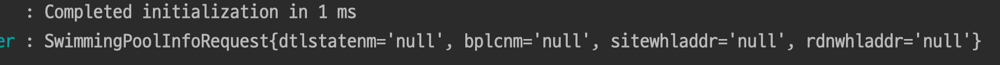
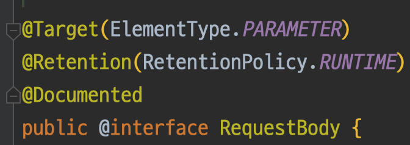
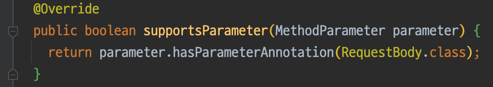
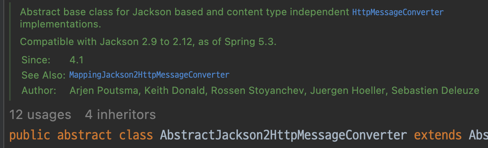
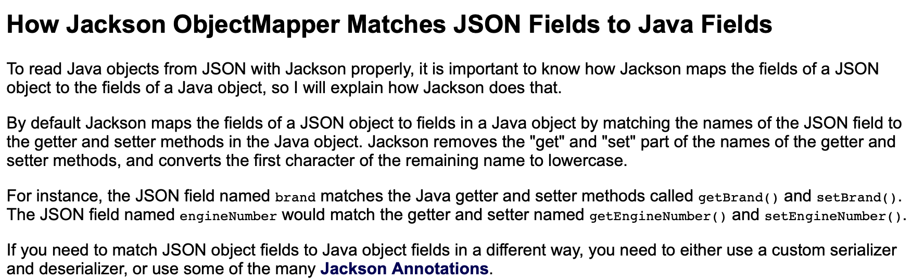

---

🍎 큰 양의 데이터를 한꺼번에 적재해본 적이 없어 다량의 데이터가 아닌 한 건의 데이터로 Flow를 잡은 후 큰 데이터를 처리하는 방법을 선택했습니다.

🍎 코드 작성 시 Domain을 우선적으로 생성하는 것이 아닌 Presentation 계층 먼저 작성하기 시작했습니다.

❓ 왜 Domain을 먼저 작성하지 않고 Presentation(Controller)부터 코드를 작성했나요?

→ Controller 부터 작성한 이유는 행위를 먼저 결정하기 위함입니다. 여기서 이야기하는 행위는 객체가 갖는 메소드를 이야기하기보단 프로젝트에서 받은 요청이 수행되는 행위를 뜻합니다.

→ 이를 통해 얻을 수 있는 장점은 데이터 중심적으로 생각하지 않게되고 유연하게 Domain의 상태(property)를 가져갈 수 있습니다.

⚠️ 문제가 발생했습니다. Log를 통해 값을 찍어보던 중 값이 도달하지 않는 것을 발견했습니다. InMemory로 진행되는 프로젝트에서 값이 들어가 식별자 값이 들어가는 것까지 정상적으로 동작하는 것을 확인했는데 추적해보니 @RequestBody를 통해 DTO Request가 들어올 때 값을 읽어오지 못하는 것이었습니다.

→ 아래와 같이 문제가 발생합니다.

→ 여태 @RequestBody 내부 동작을 생각해보지 않은 채 사용해 발생한 문제입니다.

❓RequestBody 내부엔 어떤 것들이 있길래 Json Type Request DTO의 값을 읽어오는 것인가요?

> Annotation indicating a method parameter should be bound to the body of the web request. The body of the request is passed through an [HttpMessageConverter]
 to resolve the method argument depending on the content type of the request. Optionally, automatic validation can be applied by annotating the argument with `@Valid`
> 

→ 공식 문서에서 나온 이야기를 보면 컨텐츠의 유형에 따라 HttpMessageConverter를 통해 전달이된다고 나와있습니다.

❓그런데 RequestBody는 File type은 @interface입니다. 어떤 방식으로 데이터를 전달하는건가요?

→ Annotation은 상속을 할 수 없고 프로그램에게 추가 정보를 제공하는 메타 데이터를 위해서 사용됩니다.

❓어떤 방식으로 Annotation을 읽어오는 것일까요?

→ 이를 알기 위해선 Spring mvc 구조를 알아야 합니다.

- Request가 들어오면 HandlerMapping을 통해 사용자의 요청과 해당 요청을 초리하는 Hanller를 매핑합니다.
- 다음 HandlerMethodArgumentResolver를 사용해 Controller의 Argument(Parameter)에 지정된 변수들을 Annotation이나 객체의 Type에 따라서 Resolver를 거칩니다.

→ HandlerArgumentResolver를 상속한 `RequestResponseBodyMethodProcessor` 를 보면 @RequestBody를 확인하는 것을 볼 수 있습니다.

→ @RequestBody를 사용한 것이 확인이 된다면 read Or write로 넘어가게 됩니다.

→ Content-type이 Json인 것을 안 후 Jackson Converter를 통해 Json Data가 직렬화됩니다. 이 때 사용되는 것이 ObjectMapper입니다.

🍏 ObjectMapper가 Json type 데이터를 매치하는 방식

🍎 ObjectMapper를 통해 Json file을 직렬화를 한 경우 결과

→ 이를 보면 데이터가 잘 들어온 것을 볼 수 있습니다.

✅ 직렬화 과정이 필요할 땐, Getter와 기본 생성자를 붙여 사용하자

---

📚 Reference

[RequestBody (Spring Framework 6.0.3 API)](https://docs.spring.io/spring-framework/docs/current/javadoc-api/org/springframework/web/bind/annotation/RequestBody.html)

[Jackson ObjectMapper](https://jenkov.com/tutorials/java-json/jackson-objectmapper.html#how-jackson-objectmapper-matches-json-fields-to-java-fields)

[[Spring] - @RequestBody 어노테이션의 동작방식](https://kim-jong-hyun.tistory.com/60)