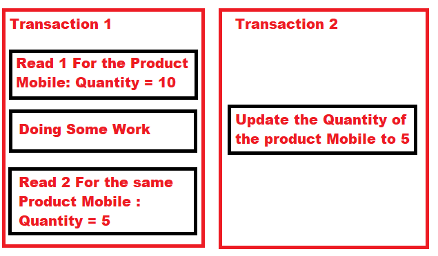

---

🍎 새로 알게된 사실 혹은 알고 있던 사실에대한 질문, 답변

❓ 클러스터링이란 무엇인가요?
→ DB에서 클러스터란 여러개의 서버가 하나의 DB를 나눠서 처리하는 형태를 뜻합니다. InnoDB는 PK를 기준으로 클러스터링되어 저장된다는 말은 PK 값의 순서대로 디스크에 저장된다는 뜻이며 이는 PK를 통한 Range Scan을 빠르게 처리할 수 있게 합니다.

🍎 InnoDB Storage Arch

  🍏 MVCC(Multi Version Concurrency Control)
  → MVCC의 가장 큰 목적은 잠금을 사용하지 않는 일관된 읽기를 제공하는 데 있다. InnoDB는 Undo Log를 이용해 이 기능을 구현한다.
  → 격리 수준에 따라 반환하는 데이터가 다릅니다.
  → 이를 MVCC라고 표현하고 하나의 레코드에 대해 2개의 버전이 유지되고, 필요에 따라 어느 데이터가 보여지는 지 여러 가지 상황에 따라 달라지는 구조를 의미합니다.

  🍏 잠금 없는 일관된 읽기
  → 격리 수준이 SERIALIZABLE이 아닌 경우 INSERT와 연결되지 않은 순수한 읽기 작업은 다른 트랜잭션의 변경 작업과 관계없이 항상 잠금을 대기하지 않고 바로 실행된다. 이 때, 언두 로그를 사용합니다.
  → 오랜 시간 동안 활성 상태인 트랜잭션으로 인해 MySQL 서버가 느려지거나 문제가 발생할 수 있습니다. 이는 일관된 읽기를 위해 언두 로그를 삭제하지 못하고 계속 유지해야 하기 때문에 발생하는 문제입니다.

  🍏 자동 데드락 감지
  → InnoDB 스토리지 엔진은 내부적으로 잠금이 교착 상태에 빠지지 않았는지 체크하기 위해 잠금 대기 목록을 그래프 형태로 관리합니다.
  → 데드락 감지 스레드가 강제 종료 시키는 트랜잭션의 순서는 언두 로그 양이며, 언두 로그 레코드를 더 적게 가진 트랜잭션이 일반적으로 롤백의 대상이 됩니다.
  → 이는 롤백을 해도 언두 처리를 해야 할 내용이 적다는 것이며, 트랜잭션 강제 롤백으로 인한 MySQL 서버의 부하도 덜 유발하기 때문입니다.

  ❓ 데드락 감지 스레드를 사용해 자동 데드락 감지를 할 때 문제는 없을까요?
  → 동시 처리 스레드가 매우 많아지거나 각 트랜잭션이 가진 잠금의 개수가 많아지면 데드락 감지 스레드가 느려집니다.
  → 데드락 감지 스레드는 잠금 목록을 검사해야 하기 때문에 잠금 상태가 변경되지 않도록 잠금 목록이 저장된 리스트에 새로운 잠금을 걸로 데드락 스레드를 찾게 됩니다.
  → 데드락 감지 스레드가 느려지면 서비스 쿼리를 처리 중인 스레드는 더는 작업을 진행하지 못하고 대기하면서 서비스에 악영향을 미치게 됩니다.

  ❓ 격리 수준은 어떤 것들이 존재하고 존재하는 이유는 무엇인가요?
  → 격리 수준(트랜잭션의 격리 수준, isolation level)이란 여러 트랜잭션이 동시에 처리될 때 특정 트랜잭션이 다른 트랜잭션에서 변경하거나 조회하는 데이터를 볼 수 있게 허용할지 말지를 결정하는 것입니다.
  → 격리 수준이 필요한 이유는 애플리케이션에서 사용하는 DBMS, 사용하는 트랜잭션, 설계한 테이블 등 다양한 상황에 맞춰 적절한 것을 골라 수행하기 위함입니다.(= 최적화)

  * READ UNCOMMITTED
    → 어떤 트랜잭션에서 처리한 작업이 완료되지 않았는데도 다른 트랜잭션에서 볼 수 있는 현상을 Dirty Read라 하고, 더티 리드가 허용되는 격리 수준이 Read Uncommitted입니다.

  * READ COMMITTED
    → 오라클 DBMS에서 기본으로 사용되는 격리 수준이며, 온라인 서비스에서 가장 많이 선택되는 격리 수준입니다. 이 레벨에서는 더티 리드 같은 현상은 발생하지 않습니다.
    → 하지만, 해당 레벨에선 NON-REPEATABLE READ가 발생할 수 있습니다.
    → 이는 데이터 정합성이 중요한 비지니스 정책에 어긋나는 결과를 초래할 수 있습니다.
    
    → 이미지에서 볼 수 있듯이 하나의 트랜잭션 안에서 조회 시 값이 다른 경우가 발생할 수 있습니다.

  * REPEATABLE READ
    → MySQL의 InnoDB 스토리지 엔진에서 기본으로 사용되는 격리 수준이다. READ COMMITTED 격리 수준에서 발생하는 NON-REPEATABLE READ 부정합이 발생하지 않습니다.
    → InnoDB 스토리지 엔진은 트랜잭션이 ROLLBACK될 가능성에 대비해 변경되기 전 레코드를 언두 공간에 백업해두고 실제 레코드 값을 변경합니다. (MVCC 사용)
    → REPEATABLE READ는 MVCC를 위해 undo 영역에 백업된 이전 데이터를 이용해 동일 트랜잭션 내에서는 동일한 결과를 보여줄 수 있도록 보장합니다.

    ❓ REPEATABLE READ는 문제가 없을까요?
    → Select ... For Update or Select ... Lock In Share Mode로 조회되는 레코드는 언두 영역의 변경 전 데이터를 가져오는 것이 아니라 현재 레코드의 값을 가져왔을 때 PHANTOM READ 문제가 발생할 수 있습니다.
    → 한 트랜잭션에서 다른 트랜잭션에서 수행한 변경 작업에 의해 레코드가 보였다 안 보였다 하는 현상이 생길 수 있습니다. 이를 PHANTOM READ라고 합니다.

  * SERIALIZABLE
    → 트랜잭션의 격리 수준이 SERIALIZABLE로 설정되면 읽기 작업도 공유 잠금을 획득해야만 하며, 동시에 다른 트랜잭션은 그러한 레코드를 변경하지 못하게 됩니다. 즉, 한 트랜잭션에서 읽고 쓰는 레코드를 다른 트랜잭션에서는 절대 접근할 수 없는 것입니다.

  ❓ Undo Log란 무엇인가요?
  → InnoDB 스토리지 엔진은 트랜잭션과 격리 수준을 보장하기 위해 DML(INSERT, UPDATE, DELETE)로 변경되기 이전 버전의 데이터를 별도로 백업합니다. 이렇게 백업된 데이터를 언두 로그라고 합니다.

---
📚 Reference
[Transcation Level](https://dotnettutorials.net/lesson/non-repeatable-read-concurrency-problem/)
