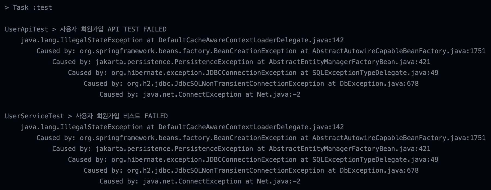

---

🍎 새로 알게된 사실 혹은 알고 있던 사실에대한 질문, 답변

🍏 독립된 테스트 전용 DB 구성의 필요성

→ 프로젝트 내에서 Entity의 PK는 Auto_Increment 혹은 sequence 등에 의해 증가된 값은 롤백이 되지 않습니다. 그렇기 때문에 테스트를 위해서는 별도의 DB로 연결을 하거나 혹은 H2와 같은 휘발성(InMemory) DB를 사용하는 것이 좋습니다.

→ 또한, 분리된 DB를 설정하고 Test 격리를 진행하게 되면 매 요청마다 BeforeEcah로 DB가 Clear되기 때문에 실제 운영되는 DB를 사용하는 것은 적절하지 않습니다.

🍏 장점
- 외부 영향없이 완벽하게 독립적인 데이터로 테스트가 가능하다.
- 타 DB 서비스 정상 동작 여부에 영향을 받지 않는다.
- 원하는 테스트 데이터를 마음대로 구성할 수 있습니다.
- 테스트 수행 수 데이터 롤백이 필요 없습니다.
- Embedded DB 사용으로 빠른 결과 도출을 기대할 수 있습니다.

🍏 단점
- 실제 쿼리 수행과 완벽하게 동일하지 않을 수 있습니다.
- 개발사항에 따라 스키마 초기화 구성을 최신화 시켜줘야합니다.

test slice
❗️ h2 DB를 읽어오지 못하는 문제 발생

→ 다음과 같은 문제가 발생한 원인은 DataSource를 찾지 못해서 발생한 문제입니다. localhost~dbName으로 설정되어 있을 땐 CI에서 값을 읽지 못해 url: jdbc:h2:mem:jblyInMemory 와 같은 방식으로 설정해야합니다.

---
📚 Reference

- [SpringTranscarion이란](https://mangkyu.tistory.com/170)
- [isolation DB 구축](https://taes-k.github.io/2021/04/05/spring-test-isolation-datasource/)