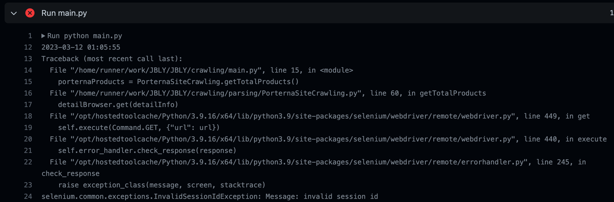
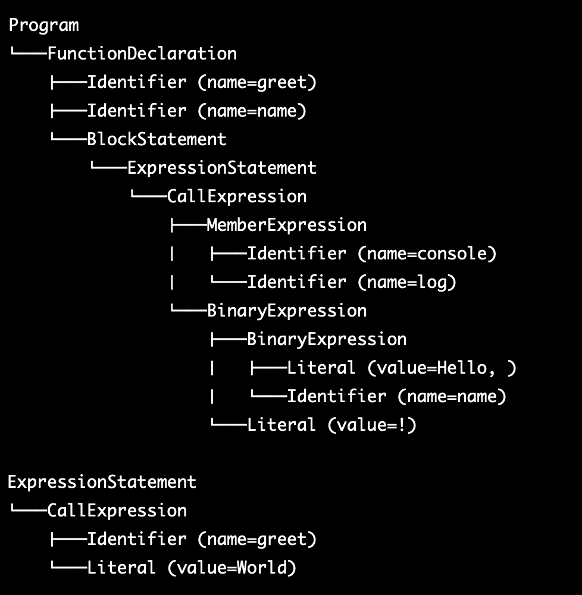

---

🍎 새로 알게된 사실 혹은 알고 있던 사실에대한 질문, 답변

❓ Selenium Invalid session ID의 발생 원인은 무엇인가요?

<발생한 문제>

→ 해당 문제는 Selenium의 WebDriver Engine이 종료될 부분이 존재하지 않은 채 .close() Method를 호출해 발생한 문제입니다.

→ Web Engine 사용을 걷어내는 과정에서 해당 문제를 해결했습니다.

❓ AST(Abstract Syntax Tree)란 무엇인가요? AST가 필요한 이유는 무엇인가요? 

→ AST는 코드의 구문 구조를 추상적인 트리 형태로 나타낸 것으로, 프로그래밍 언어에서 코드를 분석하고 처리하는 데 사용됩니다.

→ 컴파일러나 인터프리터는 소스 코드를 실행 가능한 코드로 변환하기 위해 여러 단계의 처리를 수행합니다. 이러한 처리 중 하나는 소스 코드를 분석하여 문법적인 구조를 파악하는 것입니다. 이를 위해 코드를 토큰화하고, 파싱하여 AST를 생성합니다. 이 AST는 코드의 추상적인 구문 구조를 나타내며, 컴파일러나 인터프리터가 이를 기반으로 다양한 처리를 수행합니다.

→ AST가 필요한 이유는 여러 가지가 있습니다. 첫째, AST는 코드 분석에 필요한 정보를 추상적이고 구조화된 형태로 제공합니다. 이를 통해 코드 분석이 더욱 효율적으로 이루어질 수 있습니다. 둘째, AST는 코드 생성에 사용될 수 있습니다. 예를 들어, JIT(Just-In-Time) 컴파일러는 실행 중에 AST를 생성하고 이를 기반으로 코드를 생성합니다. 셋째, AST는 코드 변환에 사용될 수 있습니다. 예를 들어, 코드 리팩토링 도구는 AST를 기반으로 코드를 재구성합니다.

따라서 **AST는 프로그래밍 언어 처리에 필수적인 요소 중 하나이며, 코드 분석, 생성 및 변환에 사용**됩니다.

❓ AST와 SPA(Front Side)와의 관계는 무엇인가요?

→ AST(Abstract Syntax Tree)와 SPA(Single Page Application)는 전혀 다른 분야에서 사용되는 용어입니다. AST는 프로그래밍 언어 처리에 필요한 개념으로, 코드의 추상적인 구문 구조를 나타내는 트리 형태의 데이터 구조입니다. SPA는 웹 개발에서 사용되는 용어로, 하나의 페이지 내에서 모든 필요한 요소를 불러오는 애플리케이션을 말합니다.

→ 따라서 AST와 SPA는 서로 직접적인 연관관계가 없습니다. 하지만, AST는 SPA를 개발할 때 JavaScript 코드 분석에 사용될 수 있습니다. SPA는 JavaScript 기반으로 개발되며, JavaScript 코드를 분석하여 SPA의 라우팅, 상태 관리 등을 구현할 수 있습니다. 이때 AST를 사용하면 JavaScript 코드를 보다 효율적으로 분석할 수 있으며, SPA의 개발이 더욱 쉬워질 수 있습니다.

→ 또한, AST를 사용하여 SPA의 성능 개선에도 도움이 됩니다. SPA는 대개 클라이언트 측에서 실행되기 때문에, 빠른 로딩 속도와 최적화된 자원 관리가 중요합니다. 이때 AST를 사용하여 JavaScript 코드를 분석하면, 불필요한 코드를 제거하거나 최적화할 수 있습니다. 이를 통해 SPA의 성능 개선과 자원 효율성 향상을 도모할 수 있습니다.

🌊 "AST를 사용하면 JavaScript 코드를 보다 효율적으로 분석할 수 있으며, SPA의 개발이 더욱 쉬워질 수 있습니다." DEEP DIVE 🌊

1. 코드 분석 효율성 향상

→ AST를 사용하면 JavaScript 코드를 분석할 때, 토큰화 및 파싱 과정에서 발생하는 오버헤드를 줄일 수 있습니다. 이는 AST가 코드를 추상적인 트리 형태로 나타내므로, 코드를 분석하기 위해 불필요한 작업을 줄일 수 있기 때문입니다. 이를 통해 코드 분석 속도를 높이고, 더욱 정확하게 코드를 분석할 수 있습니다.

2. 코드 최적화

→ AST는 코드의 추상적인 구문 구조를 나타내므로, JavaScript 코드를 분석하여 불필요한 코드나 느린 코드를 제거하거나 최적화할 수 있습니다. 이를 통해 SPA의 성능을 개선하고, 불필요한 자원 사용을 줄일 수 있습니다.

3. 코드 변환

→ AST는 JavaScript 코드를 추상적인 트리 형태로 나타내므로, 이를 기반으로 JavaScript 코드를 변환할 수 있습니다. 예를 들어, Babel과 같은 JavaScript 컴파일러는 AST를 사용하여 ES6 코드를 ES5 코드로 변환할 수 있습니다. 이를 통해 브라우저 호환성 문제를 해결하고, SPA의 개발을 더욱 쉽게 할 수 있습니다.

→ 따라서, AST를 사용하면 JavaScript 코드를 보다 효율적으로 분석할 수 있으며, 이를 기반으로 코드 최적화 및 변환을 수행할 수 있습니다. 이를 통해 SPA의 개발 및 성능 최적화에 도움이 되며, 보다 효율적이고 성능 우수한 SPA를 개발할 수 있습니다.

❗ AST, JS 연계 예시

#### 예제 코드
```js
function greet(name) {
  console.log("Hello, " + name + "!");
}

greet("World");
```



→ 위 트리에서 Program은 코드 전체를 나타내는 루트 노드이고, FunctionDeclaration은 greet 함수를 선언하는 노드입니다. Identifier는 변수명이나 함수명을 나타내는 노드이고, BlockStatement은 함수의 본문을 나타내는 노드입니다.

→ 또한, ExpressionStatement은 표현식을 실행하는 노드이고, CallExpression은 함수 호출을 나타내는 노드입니다. MemberExpression은 객체의 속성에 접근하는 노드이고, BinaryExpression은 두 개의 표현식을 이항 연산자로 결합한 노드입니다. 이와 같이 AST는 코드의 추상적인 구문 구조를 트리 형태로 나타내므로, 코드 분석 및 최적화에 유용합니다.

❓ FE 부분 말고 Java(BE) 진영에서도 AST가 도움이 될까요?

→ Java 컴파일러는 소스 코드를 파싱하여 AST를 생성합니다. 이 AST를 활용하여 자바 코드의 구조를 파악하고 분석할 수 있습니다. 예를 들어, 자바 코드의 문법 오류 검사, 코드의 가독성 및 유지보수성 향상을 위한 리팩토링, 자동 코드 생성 등에 AST를 활용할 수 있습니다.

→ 또한, 자바 외부 라이브러리인 Eclipse JDT(Java Development Tools)는 자바 코드를 AST로 변환하고 이를 활용하여 코드 분석, 리팩토링 등의 작업을 수행하는 기능을 제공합니다. 이를 통해 자바 개발자들은 보다 효율적이고 안정적인 개발을 할 수 있습니다.

📚 Reference

[WebDriver Session Error Doc](https://developer.mozilla.org/en-US/docs/Web/WebDriver/Errors/InvalidSessionID)