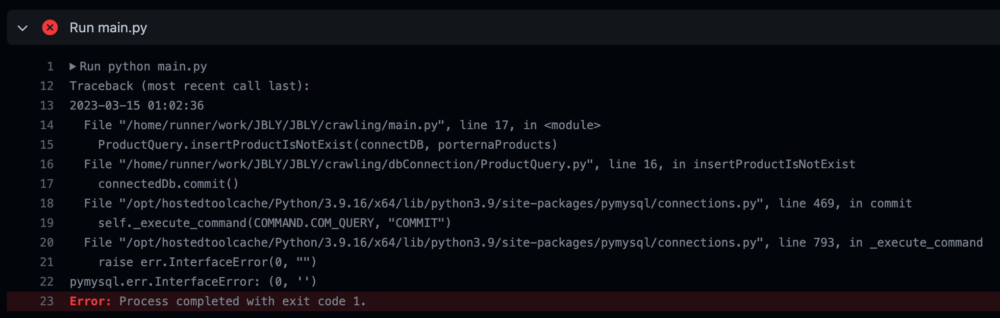

---

🍎 새로 알게된 사실 혹은 알고 있던 사실에대한 질문, 답변

🐞 Github Action에서 Python VM에 scheduling된 Crawling을 수행 시 아래와 같은 문제 발생

<pymysql.err.interfaceError_발생>

🍏 이 문제를 해결하기 위해 pymysql의 내부 동작을 알아햐합니다.

1. Pymysql 모듈을 import한다.
2. pymysql.connect() Method를 사용하여 Mysql에 Connect한다. hostName, dbName, dbUser, dbPwd, port를 파라미터로 입력한다.
3. DB 접속이 성공하면, Connection 객체로부터 cursor() Method를 호출하여 Cursor 객체를 가져온다. DB 커서는 Fetch 동작을 관리하는데 사용됩니다. 만약 DB 자체가 curosr를 지원하지 않으면 python DB API에서 커서 동작을 Emulation하게 됩니다.
4. Cursor 객체의 execute() Method를 사용하여 SQL 문장을 DB 서버에 보냅니다.
5. SQL 쿼리의 경우 Cursor 객체의 fetchall(), fetchone, fetchmany() 등의 메서드를 사용하여 데이터를 서버로부터 가져온 후, fetch된 데이터를 사용합니다.
6. CUD를 수행 후 commit() Method를 사용하여 데이터를 확정 갱신합니다.
7. 마지막으로 연결된 cursor 객체와 connection 객체를 close()를 사용해 연결을 종료한다.

→ interfaceerror의 원인은 connection을 종료하지 않아서 발생한 에러이기도 합니다. 이를 Connection leak이라고 부릅니다.

→ SQL Connection을 열고 프로그램 중간에서 에러가 발생하면, Connection은 그대로 열려 있는 상태로 있을 수 있습니다. 이렇게 오픈되어 있는 Connection이 증가하면, 나중에 새로운 Connection을 열 수 없게 되는데, 이를 Connection Leak이라고 부릅니다.

→ Connection Leak을 막기 위해 try catch finally를 사용해 close해주는 것이 좋습니다.

📝 Emulation이란 무엇인가요?

→ Emulation은 HW, SW, ETC System등의 동작을 다른 환경에서 모사하여 동일하게 작동하도록 하는 기술입니다. 이는 원래 HW or SW에서 작동하는 애플리케이션을 다른 플랫폼이나 OS에서 실행하도록 허용합니다.

📚 Reference

[DB Connection Interface Error 참조 사이트](http://pythonstudy.xyz/python/article/202-MySQL-쿼리)