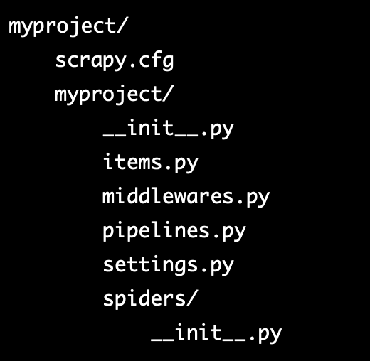

---

🍎 새로 알게된 사실 혹은 알고 있던 사실에대한 질문, 답변

❓ 무슨 이유로 Selenium Crawling 환경에서 Scrapy Crawling 환경으로 변경한 것인가요?

→ 변경한 이유는 두 가지입니다.

→  첫 번째, Selenium은 브라우저를 직접 제어하여 웹 페이지를 렌더링하고 사용자 상호작용을 시뮬레이션할 수 있습니다. 따라서, Selenium을 사용하면 웹 페이지의 렌더링 결과를 가져올 수 있습니다. webDriver headless 기능을 사용해 UI없이 백그라운드에서 브라우저를 실행해, 이를 이용하여 랜더링 없이 웹 페이지의 컨텐츠를 추출할 수 있습니다.

→ 하지만, 근본적으로 웹 브라우저(web Engine)를 직접 제어하는 입장에서 리소스가 많이 발생합니다. 그러나, Scrapy는 웹 엔진을 직접 제어하지 않습니다.

→ 두 번째, Multi Thread 환경 제공입니다. Scrapy는 Scrapy Cluster를 제공해 병렬 처리(동시 처리)를 제공합니다. 반면, Selenium은 제공하지 않습니다.

→ 위 두 이유로 리소스를 많이 줄일 수 있다고 판단되어 Selenium에서 Scrapy를 사용하게 됐습니다.

🍎 Scrapy Dir 구조와 각 구조의 역할

<Scrapy는 아래 이미지와 같은 디렉토리 구조를 갖고 있습니다.>

🍋 scrapy.cfg

→ scrapy.cfg 파일은 Scrapy 프로젝트의 구성(configuration) 파일입니다. 이 파일은 Scrapy가 실행될 때, 프로젝트의 설정 정보를 제공하고 Scrapy가 수행할 작업을 지정합니다.

→ scrapy.cfg 파일은 다음과 같은 정보를 포함합니다:
- 프로젝트의 이름
- Scrapy가 사용할 설정 정보, 예를 들어, Scrapy가 사용할 User-Agent, 로그 레벨, 로그 포맷 등
- Scrapy가 실행할 스파이더(spider) 리스트
  
scrapy.cfg 파일은 Scrapy가 실행될 때, Scrapy가 이 파일에서 설정 정보를 읽어와 Scrapy가 실행될 때 필요한 모든 설정을 적용합니다. 예를 들어, Scrapy가 실행될 때, scrapy.cfg 파일에서 USER_AGENT 값을 읽어와 스파이더가 웹사이트를 크롤링할 때 해당 User-Agent로 요청을 보냅니다.

🍋 items.py

→ Scrapy에서는 items.py 파일을 사용하여 스크래핑한 데이터를 정의하고 저장하는 데 사용됩니다.

→ items.py 파일에는 스크래핑한 데이터의 필드를 정의합니다. 이 필드는 스크래핑한 데이터의 특정 부분에 해당하며, 각 필드는 데이터베이스에 저장할 수 있는 데이터 타입으로 정의됩니다.

→ Scrapy에서는 Item 객체를 사용하여 스크래핑한 데이터를 캡슐화하고, 이를 데이터베이스나 파일 등의 저장소에 저장합니다. items.py 파일에서는 각각의 Item 클래스를 정의하여 Item 객체를 생성하고, 각 Item 객체에 저장될 데이터의 필드를 정의합니다.

→ 이렇게 정의된 Item 클래스는 Spider에서 스크래핑한 데이터를 추출하여 Item 객체를 생성하고, 이를 Item Pipeline으로 전달합니다. Item Pipeline에서는 Item 객체를 받아 데이터 정제, 저장 등의 작업을 수행하고, 최종적으로 저장소에 저장합니다.

🍋 middlewares.py

→ Scrapy의 middleware는 다양한 역할을 수행하는 컴포넌트로, 스크래핑 프로세스 중간에 요청(Request)과 응답(Response) 객체를 조작하거나 추가적인 처리를 수행하는 데 사용됩니다.

Scrapy에서는 다음과 같은 middleware를 제공합니다.

- Downloader Middleware : 스크래핑 시 HTTP 요청과 응답 객체를 가로채고 조작할 수 있습니다. 예를 들어, User-Agent나 Cookie를 추가하는 등의 작업을 수행할 수 있습니다.
- Spider Middleware : Spider에서 생성한 요청(Request) 객체와 응답(Response) 객체를 가로채고 조작할 수 있습니다. 예를 들어, 요청 객체의 URL을 변경하거나 응답 객체의 HTML을 조작하는 등의 작업을 수행할 수 있습니다.
- Item Middleware : Item Pipeline에서 수행되기 전에 Item 객체를 가로채고 조작할 수 있습니다. 예를 들어, Item 객체의 데이터를 정제하거나 추가적인 데이터를 생성하는 등의 작업을 수행할 수 있습니다.

→ 각각의 middleware는 개별적인 클래스로 구현되며, 사용자가 직접 만들어서 사용할 수도 있습니다. Scrapy의 middleware를 사용함으로써, 스크래핑 프로세스에서 발생할 수 있는 다양한 문제를 처리하고 데이터를 보다 정교하게 다룰 수 있습니다.

🍋 pipelines.py

→ Scrapy는 웹 스크래핑을 위한 파이썬 프레임워크로, 데이터 수집, 처리 및 저장을 위한 다양한 기능을 제공합니다. 그 중 하나가 Pipeline입니다.

→ Pipeline은 스크래핑한 데이터를 받아서 처리하고 저장하는 파이프라인입니다. 스크래핑한 데이터를 받아서 중복 제거, 데이터 정제, 데이터베이스 저장 등의 작업을 수행합니다. 각각의 작업은 개별적인 클래스로 구현됩니다.

→ Scrapy는 다양한 Pipeline을 제공하며, 사용자가 직접 만들어서 사용할 수도 있습니다. 데이터 처리 및 저장을 위한 로직을 Pipeline에 구현함으로써, 스크래핑 코드의 가독성과 유지보수성을 향상시킬 수 있습니다.

🍋 setting.py

→ Scrapy에서 settings.py 파일은 스크래퍼 동작에 필요한 설정을 저장하는 파일입니다. 이 파일에서는 다양한 설정 옵션을 지정하여 Scrapy 동작을 세부적으로 제어할 수 있습니다.

→ settings.py 파일에서 설정할 수 있는 옵션은 다음과 같습니다.

- 스크래퍼 동작 관련 옵션 : User-Agent, 로봇 배제 규칙, 다운로드 지연 시간 등의 스크래퍼 동작에 관련된 옵션을 설정할 수 있습니다.
- 다운로더 미들웨어 관련 옵션 : HTTP 프록시, 쿠키, 자동 리디렉션 등 다운로더 미들웨어에 관련된 옵션을 설정할 수 있습니다.
아이템 파이프라인 관련 옵션 : 아이템 파이프라인에서 사용되는 설정 옵션을 지정할 수 있습니다.
- 로깅 관련 옵션 : 로그 출력 위치, 로그 레벨 등 로깅에 관련된 옵션을 설정할 수 있습니다.
- 스크래퍼 확장 관련 옵션 : 스크래퍼 확장을 사용하는 경우, 확장 관련 옵션을 설정할 수 있습니다.

🍋 spiders dir

→ Scrapy에서 spiders 디렉토리는 스크래퍼가 어떤 웹 사이트에서 어떤 데이터를 추출할지 정의하는 Spider 클래스를 포함하는 디렉토리입니다.

→ Spider 클래스는 Scrapy에서 가장 중요한 클래스 중 하나입니다. Spider 클래스는 스크래퍼가 어떤 웹 사이트를 스크래핑할지, 어떤 데이터를 추출할지, 추출된 데이터를 어떻게 처리할지 등을 정의합니다.

→ 스파이더 클래스는 scrapy.Spider 클래스를 상속받아 작성되며, 각각의 스파이더 클래스는 다음과 같은 속성과 메소드를 가지고 있습니다.

- name 속성 : 스파이더의 이름을 지정합니다.
- start_urls 속성 : 스파이더가 스크래핑을 시작할 URL을 지정합니다.
- parse 메소드 : 스파이더가 추출한 데이터를 처리하는 메소드입니다. 추출한 데이터를 Item 객체로 반환하거나, 다른 페이지로 이동하여 스크래핑을 계속하는 등의 작업을 수행합니다.

→ spiders 디렉토리는 Scrapy에서 스크래퍼가 추출할 데이터를 정의하는 가장 중요한 디렉토리 중 하나입니다. spiders 디렉토리에는 웹 사이트마다 하나 이상의 Spider 클래스를 작성하여 스크래핑을 수행합니다. 따라서, spiders 디렉토리는 Scrapy 스크래퍼 개발에서 매우 중요한 역할을 합니다.

❗ Scrapy 외부에서 spider를 호출했을 경우 Scrapy 프로젝트 설정 파일(Setting.py)에 지정된 설정 값들이 자동으로 로드되지 않기 때문에, 이에 따라 Scrapy 프로젝트에서 설정된 Pipelines도 로드되지 않을 수 있습니다.

📚 Reference

[Scrapy Cluster Repo](https://github.com/istresearch/scrapy-cluster)